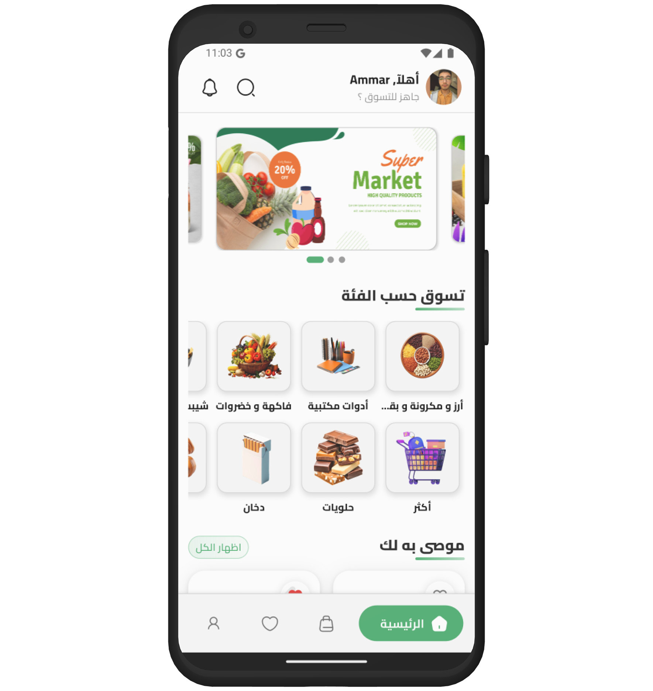

<!-- Top Anchor -->
<a name="top"></a>

# 🛒 Smarket - AI-Powered E-commerce Mobile Application

<div align="center">
  
  
  
  
  
</div>

<div align="center">
  <h2>🎓 Computer Science Graduation Project</h2>
  <p><strong>An intelligent e-commerce mobile application with AI-driven personalization, secure payments, and full Arabic localization for the Egyptian market.</strong></p>
  
</div>

---

## 📋 Table of Contents

- [About the Project](#about-the-project)
- [Key Features](#key-features)
- [Tech Stack](#tech-stack)
- [Project Architecture](#project-architecture)
- [Folder Structure](#folder-structure)
- [Getting Started](#getting-started)
- [Screenshots](#screenshots)
- [Localization](#localization)
- [Academic Context](#academic-context)
- [Contact](#contact)

---

## 📱 App Demo Preview
<div align="center"> <h3>✨ Experience Smarket in Action</h3> <p><em>A glimpse into the intelligent shopping experience</em></p> </div> <div align="center"> <table> <tr> <td align="center">  <br><strong>🠠Home Page</strong> <br><em>Powered by AI-based recommendation system</em> </td> <td align="center">  <br><strong>🛍️ Product Details</strong> <br><em>Detailed product insights and reviews</em> </td> <td align="center">  <br><strong>🤠Voice Search</strong> <br><em>Search products using speech-to-text</em> </td> </tr> </table> </div> <div align="center"> <p>💡 <strong>Powered by AI</strong> • 🔒 <strong>Secure Payments</strong> • 🌠<strong>Bilingual Support</strong> • 📱 <strong>Modern UI/UX</strong></p> </div>

---

## 🎯 About the Project

**Smarket** is a comprehensive AI-powered e-commerce mobile application developed as a Computer Science graduation project. The app demonstrates advanced mobile development practices, AI integration, and localization techniques specifically tailored for the Egyptian market.

### 🌟 Project Vision
To create a modern, intelligent shopping experience that combines cutting-edge AI technology with seamless user experience, secure payment processing, and cultural localization.

### 🎯 Target Market
- **Primary**: Egyptian e-commerce users
- **Language Support**: Arabic (RTL) and English
- **Payment Methods**: Paymob integration for local payment preferences
- **Cultural Adaptation**: UI/UX designed for Middle Eastern users

## ✨ Key Features

### 🤖 **AI-Powered Intelligence**
- **Personalized Recommendations**: Machine learning algorithms suggest products based on user behavior
- **Voice Search**: Speech-to-text integration for hands-free product discovery
- **Smart Chatbot**: AI-driven customer support with natural language processing

### 🔐 **Authentication & Security**
- **Google Sign-In Integration**: Seamless OAuth2 authentication
- **Email/Password Authentication**: Traditional login with secure validation
- **JWT Token Management**: Automatic token refresh with secure storage
- **Flutter Secure Storage**: Encrypted local data persistence

### 💳 **Payment Integration**
- **Paymob Gateway**: Full integration with Egypt's leading payment processor
- **Secure Transactions**: End-to-end encryption and PCI compliance

### 🌍 **Localization & Accessibility**
- **Bilingual Support**: Complete Arabic and English localization
- **RTL Layout**: Full right-to-left layout support for Arabic users
- **Cultural Adaptation**: Icons, colors, and UX patterns suited for Egyptian users
- **Dynamic Language Switching**: Real-time language change without app restart

### 🛍️ **Shopping Experience**
- **Product Catalog**: Rich product browsing with categories and filters
- **Shopping Cart**: Dynamic cart management with real-time updates
- **Wishlist/Favorites**: Save products for later with cloud synchronization
- **Order History**: Complete purchase history
- **Search & Filters**: Advanced product search with multiple criteria

### 📱 **Mobile-First Features**
- **Local Notifications**: Push notifications for orders, promotions, and updates
- **Responsive Design**: Optimized for all screen sizes and orientations
- **Performance Optimization**: Fast loading times and smooth animations

## 🛠️ Tech Stack

### **Frontend (Mobile)**
- **Framework**: Flutter 3.27
- **Language**: Dart 3.0+
- **State Management**: BLoC Pattern with Cubit
- **HTTP Client**: Dio with custom interceptors
- **Local Storage**: Flutter Secure Storage 
- **Localization**: Flutter Intl (l10n)

### **Development Tools**
- **IDE**: VS Code / Android Studio
- **Version Control**: Git with GitFlow workflow

## 🏗️ Project Architecture

The application follows **Clean Architecture** principles with **BLoC pattern** for state management:
<div align="center">

```
┌─────────────────┐    ┌─────────────────┐    ┌─────────────────┐
│  Presentation   │    │  Business Logic │    │   Data Layer    │
│     Layer       │◄──►│     Layer       │◄──►│                 │
│                 │    │                 │    │                 │
│ • UI Widgets    │    │ • BLoC/Cubit    │    │ • Repositories  │
│ • Pages/Screens │    │ • Use Cases     │    │ • Data Sources  │
│ • State Binding │    │ • Validation    │    │ • API Services  │
└─────────────────┘    └─────────────────┘    └─────────────────┘
```

</div>

### **Data Flow**
1. **UI Event** → User interaction triggers an event
2. **BLoC Processing** → Business logic processes the event
3. **Repository Call** → Data layer fetches/posts data
4. **State Emission** → New state emitted to UI
5. **UI Update** → Interface updates reactively

## 📁 Folder Structure

```
smarket-ecommerce-ai/
├── 📁 lib/
│   ├── 📁 core/                          # Shared utilities and components
│   │   ├── 📁 models/                    # Global data models
│   │   ├── 📁 services/                  # Shared business logic
│   │   ├── 📁 utils/                     # Constants, themes, routing
│   │   └── 📁 widgets/                   # Reusable UI components
│   │
│   ├── 📁 features/                      # Feature-based modules
│   │   ├── 📁 auth/                      # Authentication flow
│   │   ├── 📁 home/                      # Home screen & navigation
│   │   ├── 📁 cart/                      # Shopping cart management
│   │   ├── 📁 product_details/           # Product information
│   │   ├── 📁 search/                    # Search & voice search
│   │   ├── 📁 favorites/                 # Wishlist functionality
│   │   ├── 📁 profile/                   # User profile management
│   │   ├── 📁 order/                     # Order processing & history
│   │   └── 📁 notification/              # Push notifications
│   │
│   ├── 📁 l10n/                          # Localization files (AR/EN)
│   │   ├── 📄 app_ar.arb                 # Arabic translations
│   │   ├── 📄 app_en.arb                 # English translations
│   │   └── 📄 l10n.yaml                  # Localization configuration
│   │
│   ├── 📁 generated/                     # Auto-generated files
│   └── 📄 main.dart                      # Application entry point
│
├── 📁 assets/                            # App assets and resources
│   ├── 📁 images/                        # Image assets
│   ├── 📁 icons/                         # Custom icons
│   └── 📁 fonts/                         # Custom fonts
│
├── 📁 test/                              # Unit and widget tests
├── 📄 pubspec.yaml                       # Dependencies and configuration
├── 📄 analysis_options.yaml              # Dart analyzer configuration
└── 📄 README.md                          # Project documentation
```

## 🚀 Getting Started

### Prerequisites

Before running this project, make sure you have the following installed:

- **Flutter SDK** (>= 3.27.0)
- **Dart SDK** (>= 3.0.0)
- **Android Studio** or **VS Code** with Flutter extensions
- **Git** for version control
- **Android SDK** (for Android development)

### Installation Steps

1. **Clone the repository**
   ```bash
   git clone https://github.com/AmmarAlkady49/smarket-ecommerce-ai.git
   cd smarket-ecommerce-ai
   ```

2. **Install Flutter dependencies**
   ```bash
   flutter pub get
   ```

3. **Generate localization files**
   ```bash
   flutter gen-l10n
   ```

4. **Configure environment variables**
   ```bash
   # Create environment configuration file
   cp .env.example .env
   ```

5. **Run the application**
   ```bash
   # Debug mode
   flutter run
   ```

## 📸 Screenshots

<!-- > **Note**: -->

<div align="center">
  <table>
    <tr>
      <td align="center">
        
        <br><strong>Authentication</strong>
      </td>
      <td align="center">
        
        <br><strong>Home Screen</strong>
      </td>
      <td align="center">
        
        <br><strong>Product Details</strong>
      </td>
      <td align="center">
        
        <br><strong>Product Search</strong>
      </td>
    </tr>
    <tr>
      <td align="center">
        
        <br><strong>Search History</strong>
      </td>
      <td align="center">
        
        <br><strong>Speech Recognition</strong>
      </td>
       <td align="center">
        
        <br><strong>Shopping Cart</strong>
      </td>
      <td align="center">
        
        <br><strong>Checkout Process</strong>
      </td>
    </tr>
    <tr>
      <td align="center">
        
        <br><strong>wishlist</strong>
      </td>
      <td align="center">
        
        <br><strong>Settings</strong>
      </td>
      <td align="center">
        
        <br><strong>User Profile</strong>
      </td>
      <td align="center">
        
        <br><strong>Edit Profile Info</strong>
      </td>
    </tr>
    <tr>
      <td align="center">
        
        <br><strong>Order History</strong>
      </td>
      <td align="center">
        
        <br><strong>Saved Address</strong>
      </td>
      <td align="center">
        
        <br><strong>Arabic RTL Support</strong>
      </td>
      <td align="center">
        
        <br><strong>Deleting Dialog Box
</strong>
      </td>
    </tr>
  </table>
</div>

### 🎥 Demo Video
[Add link to demo video if available]</br>

<!-- BEGIN YOUTUBE-CARDS -->
name: GitHub Readme YouTube Cards
on:
  schedule:
    # Runs every hour, on the hour
    - cron: "0 * * * *"
  workflow_dispatch:

jobs:
  build:
    runs-on: ubuntu-latest
    # Allow the job to commit to the repository
    permissions:
      contents: write
    # Run the GitHub Readme YouTube Cards action
    steps:
      - uses: DenverCoder1/github-readme-youtube-cards@main
        with:
          channel_id: UCipSxT7a3rn81vGLw9lqRkg
<!-- END YOUTUBE-CARDS -->


## 🌐 Localization

The app supports both Arabic and English with complete RTL layout support:

### Supported Languages
- **Arabic (العربية)**: Full RTL support with cultural adaptations
- **English**: Default LTR layout

### Adding New Translations
1. Edit `l10n/app_en.arb` for English text
2. Edit `l10n/app_ar.arb` for Arabic text
3. Run `flutter gen-l10n` to generate translation files
4. Use in code: `context.l10n.translationKey`

### RTL Support Features
- Automatic text direction detection
- Mirrored layouts for RTL languages
- Culturally appropriate icons and imagery

## 🎓 Academic Context

### Project Scope
This application was developed as a **Computer Science graduation project** to demonstrate:

- **Advanced Mobile Development**: Cross-platform development with Flutter
- **AI Integration**: Machine learning and intelligent recommendations
- **Software Architecture**: Clean architecture and design patterns
- **Localization**: International app development practices
- **Payment Integration**: Secure e-commerce transaction handling
- **Cultural Adaptation**: Market-specific user experience design

### Learning Objectives
- Master modern mobile app development frameworks
- Implement AI-driven features in mobile applications
- Understand e-commerce business logic and workflows
- Practice secure authentication and payment processing
- Develop multilingual applications with RTL support
- Apply software engineering best practices

### Technical Achievements
- **Scalable Architecture**: Modular, feature-based code organization
- **State Management**: Advanced BLoC pattern implementation
- **API Integration**: RESTful API consumption with error handling
- **Performance Optimization**: Efficient caching and data management
- **Security Implementation**: Secure token handling and data encryption
- **Cultural Localization**: Complete Arabic/English bilingual support

### Future Enhancements
- **Machine Learning**: Enhanced recommendation algorithms
- **Analytics Dashboard**: Admin panel for business insights
- **Social Features**: User reviews and social sharing
- **Inventory Management**: Real-time stock tracking
- **Multi-vendor Support**: Marketplace functionality
- **Advanced Search**: Elasticsearch integration


## 📞 Contact

### Developer Information
- **Name**: [Ammar Fayez Alkady]
- **Email**: [ammaralkady49@gmail.com]
- **LinkedIn**: [https://www.linkedin.com/in/ammar-alkady-97417b273/]
- **GitHub**: [https://github.com/AmmarAlkady49]

### Academic Supervisor
- **Supervisor**: [Dr. Tamer Zakaria]
- **Institution**: [Alexandria University]
- **Department**: Data Science
- **Year**: 2025

---

<div align="center">
  <h3>🌟 If you found this project helpful, please consider giving it a star!</h3>
  <p><strong>Built with ❤️ using Flutter, AI, and modern development practices</strong></p>
  
  <a href="#top">Back to Top ⬆️</a>
</div>